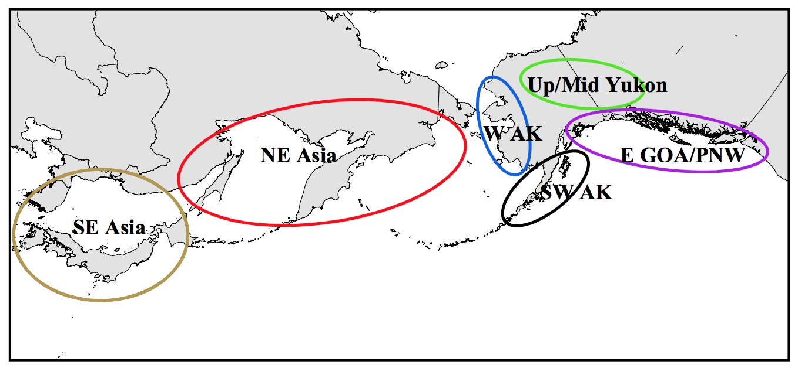
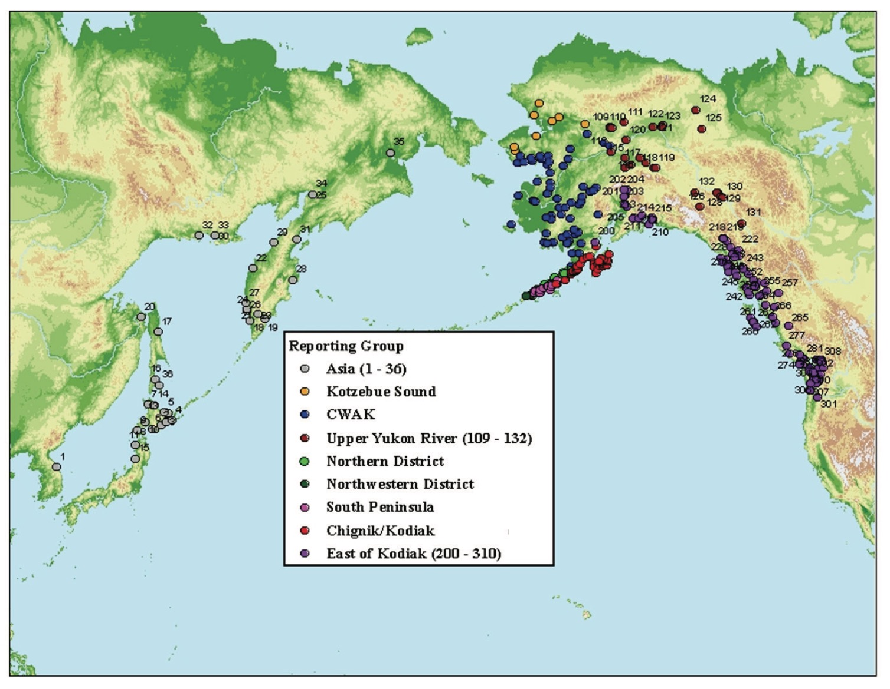

```{r setup, include=FALSE}
knitr::opts_chunk$set(echo = TRUE, warning=FALSE, message=FALSE)
library(tidyverse)
library(magrittr)
library(rubias)
library(adegenet)
library(hierfstat)
library(ggtree)

load("./BaselineEvals.RData")

```

# Overview
In 2020 the PCCRC funded a project with the following objectives:

1. Implement an efficient genetic stock identification (GSI) analytical pipeline 
to retrospectively identify consistent strata (space, time, fishing sector, 
fish age) for comparison across years
2. Quantify relationships between Bering Sea chum salmon PSC and biotic/abiotic 
variables for a suite of different strata (space, time, fishing sector, 
fish age) and examine how changes in the spatial distribution in the pollock 
fleet may affect these relationships
3. Quantify spatial patterns of chum salmon bycatch by age and stock of origin 
to determine whether near real-time information (e.g., satellite-derived sea 
surface temperatures) could be used to minimize impact of PSC on Alaska chum 
salmon stocks.

In addressing the first objective we decided that a through evaluation of the
baselines for Chinook and Chum needed to be done. The genetics lab will be 
using Rubias instead of Bayes for the genetic stock identification (GSI) 
analyses and moving from a microsatellite baseline for chum to a SNP baseline.

The purpose of this document is to make the analysis as reproducible as 
possible and serve as a useful way of collaboration among individuals 
within the lab.

# Methods
 
I don't have much of the information on tissue sampling, extractions,
amplifications so for now I will focus on the statistical analysis.

##Statistical Analysis
1. HWE and LD?
2. $F_{st}$ 
Pairwise Fst values (Nei 1987) were calculated with the package hierfstat.
3. PCA
PCA was done with the package adgenet (import as genid object) and ade4 (the actal duidi.pca)
4. NJ tree
The neighbor joining trees were constructed with ggTree based on the Nei's Fst 
5. GSI evaluations
  6a. Leave one out tests - evaluate how well fish can be assigned to their population of origin.
  We can compare these with the PofZ values for Realistic fishery simulations.
  6b. 100% simulations - A mixture is simulated; all of which originate from the same 
  population or reporting group.
  6c. Realistic fishery simulations - 100% simualtions are unrealistic
    
# Chum Microsatellite Baseline
### Description of Baseline
The chum microsatellite baseline (allele frequencies) can be downloaded 
from the Division of Fisheries and Oceans Canada (DFO) Molecular Genetics 
web page (http://www-sci.pac.dfo-mpo.gc.ca/mgl/data_e.htm) [Beacham 2009b, 
Beacham2009c]. The allele 
frequencies were converted to allele counts by Guyon et al. [@Guyonetal2010]
to create a *BAYES* [@PellaMasuda2001] baseline file. The program *rubias* 
[@MoranAnderson2019] requires genotypes for individuals. Assuming linkage and 
Hardy-Weinberg equilibirum, I generated individual genotypes by sampling 
the allele counts without replacement 
(https://patbarry6.github.io/ABL_GSI/). This will maintain the allele frequencies
and sample sizes for each population. There was a single issue where there were
an odd number of alleles scored (Locus 2 in population 240). This issue may 
be the result of conversion from allele fequencies from DFO to allele counts or
just a rounding issues from DFO with an allele frequency. My solution was to add
one to the most abundant allele. This does not appreciably change the allele
frequency and seems more reasonable that doubling the population size to have an
even number of alleles to sample. Doing so would give us an increased confidence
in our characterization of that population. 

Microsatellite allele from the NOAA lab were converted to allele size calls
from DFO by running a set of samples from DFO run on the ABL 3130xl. When TSMRI
exports their allele calls they need to convert them to the DFO allele sizes 
before running GSI on their baseline. 

The baseline is composed of 381 populations grouped into six regions: Southeast 
Asia, Northeast Asia, Western Alaska, Upper/Middle Yukon, Southwest Alaska, 
and the Eastern Gulf of Alaska/Pacific Northwest [@Kondzelaetal2013]. These
groupings were selected based on principal coordinate analysis (PCO), NJ trees
with Cavalli-Sforza and Edwards chord distances [Beacham2009], and simulations
were conducted in SPAM software (100%, equal, and realistic fishery mixture 
proportions). I wonder if we will be able to split out the E GOA and PNW 
populations with the new SNP baseline. That might open up a giant can of 
political worms.



So let's read in the chum microsatellite baseline formatted for rubias.

```{r ChumBaselineRubias, include=T, eval = T}
ChumUsatBase<-read.csv("./MasterData/ChumBaseline_rubias.csv",stringsAsFactors = F)
RepGroups_ChumUsat<-ChumUsatBase%>%
          group_by(repunit)%>%
          summarise(nPops = length(unique(collection)),
                    nInd = length(unique(indiv)))
  
knitr::kable(RepGroups_ChumUsat)

```

For the reporting groups the size of the GOA/PNW greatly exceeds that of the 
other groups. And Southwest AK has the fewest number of collections. Let's take
a closer look at how man indiviuals represent each collection. 

```{r ChumBaselineRubias2, include=T, eval = T}
CollectionInfo_ChumUsats<-ChumUsatBase%>%
          group_by(repunit,collection)%>%
          summarise(nInd = length(unique(indiv)))

CollectionInfo_ChumUsats%>%
  group_by(repunit)%>%
  top_n(10)%>%
  knitr::kable()%>%
  kableExtra::kable_styling()

```

 Within the collections the average size is 
`r sprintf(mean(CollectionInfo$nInd),fmt='%#.2f')` 
(min = `r min(CollectionInfo$nInd)` and max = 
`r max(CollectionInfo$nInd)`). Surprisingly, we have pretty good sample sizes 
for the Russia (NAsia collections). 

### HWE & LD
This baseline has been extremely well vetted. It seems like a small waste of 
time to run these tests right now, but if we decide to make this a short 
manuscript it might be a good idea to re-run the analyses just to be on the 
safe side. 

## $F_{st}$
First we need to convert the rubias input file into a genepop input file with 
a POP designator. This shouldn't be too difficult. We can just create an 
index by population and write each population as a group of lines to a text 
file. 

```{r Fst, echo = TRUE, eval = FALSE}
Loci<-colnames(ChumUsatBase)[-(1:4)] %>%
      .[c(TRUE,FALSE)]
Title<-"ChumBaseline"


ChumGenos<-sapply(1:(length(Loci)*2), function(x) formatC(ChumUsatBase[,-(1:4)][,x], width=3,
                                                          format="d",flag="0")) 
colnames(ChumGenos)<-colnames(ChumUsatBase[,-(1:4)])

ChumGenos6<-lapply(Loci, function(x) apply(ChumGenos[,
                                                 grep(pattern=x,
                                                     x=colnames(ChumGenos))],
                                             MARGIN = 1,
                                             paste,
                                             collapse = "")%>%
                     as.vector())

ChumGenosMat<-do.call(cbind,ChumGenos6)
ChumGenosMat[ChumGenosMat == " NA NA"]<-"000000"

collections<-unique(ChumUsatBase$collection)
PopIndex<-lapply((1:length(collections)), function(x) 
                              which(ChumUsatBase$collection==collections[x]))

write.table(Title,"ChumBaseline_gp.gen",append=F,quote=F,row.names=F,col.names = F)
write.table(Loci,"ChumBaseline_gp.gen",append=T,quote=F,row.names=F,col.names = F)

for (x in 1:length(collections)){
  write.table("POP","ChumBaseline_gp.gen",append=T,quote=F,row.names=F,col.names = F)
  TempPop <- data.frame(id=ChumUsatBase[PopIndex[[x]],4],
                      ChumGenosMat[PopIndex[[x]],],stringsAsFactors = F)
  Lines2write <- sapply(1:nrow(TempPop),function(y) 
                   paste(TempPop[y,1], " , " ,
                         paste(as.character(TempPop[y,-1]),collapse=" "),
                         sep=""))
  write.table(Lines2write,"ChumBaseline_gp.gen",append=T,quote=F,row.names=F,col.names = F)
  }

```

Ok, so now we have a genepop file for the chum microsatellite baseline. Let's 
pull it into R with adgenet's read genepop function and then calculate some 
Nei's $F_{st}$ values. In the markdown document we won't evaluate this piece 
everytime becuase the bootstrapping over 300 populations can take some time. 
Instead we will read in the results at the top of the document. 

```{r Fst_microsatellites, eval=F, echo=T}
Chum_uSatBase.genid<-adegenet::read.genepop("./ChumBaseline_gp.gen",ncode=3)
ChumuSatBase_hierf <- hierfstat::genind2hierfstat(Chum_uSatBase.genid)

Chum_uSatFst.Nei<-hierfstat::pairwise.neifst(ChumuSatBase_hierf)

Chum_uSatFst_bs <- hierfstat::boot.ppfst(dat=ChumuSatBase_gdf,nboot=100,quant=c(0.025,0.975),diploid=TRUE)

diag(Chum_uSatFst.Nei)<-0
```

I originally made a heatmap based on the $F_{st}$ distances, but it is pretty
darn ugly, and a neighbor joining tree uses the same information in a much easier
format to digest. 

## NJ Tree

```{r NJtree_ChumuSats, eval=T, echo=T}
NJ.chumuSat.Nei<-phangorn::NJ(Chum_uSatFst.Nei)

NJ.chumuSat.Nei$tip.label<-unique(gsub(pattern="_[0-9]+$",replacement="",Chum_uSatBase@pop))

PopRepGroups_ChumuSat<-ChumUsatBase%>%
   group_by(repunit,collection)%>%
   slice(1)%>%
   select(Pop = collection ,RepGroup = repunit)%>%
   ungroup()
 
# p + geom_text2(aes(subset=!isTip, label=node)) #use this line to get the node number

# viewClade(pNei, node=612) #use this line to look at a specific node
  
P_ChumuSat<-ggtree(NJ.chumuSat.Nei) %<+% PopRepGroups_ChumuSat +
  geom_tiplab(aes(fill = factor(RepGroup)),
              size = 1.75,
              color = "black", # color for label font
              geom = "label",  # labels not text
              label.padding = unit(0.15, "lines"), # amount of padding around the labels
              label.size = 0.01) + 
  theme(legend.position = c(0.8,0.2), 
        legend.title = element_blank(), # no title
        legend.key = element_blank())

P_ChumuSat

```

That looks pretty good. Southeast Asia, Western Alaska, and the Upper/Middle Yukon
all look like great groupings. All the collections in the reporting units are
included under distinct nodes. The majority of the SW Alaska collections are
grouped within a node with GOA/PNW samples; however, there are a few collections
from South Bristol Bay that group with the North Asia collections. 

Let's take a closer look at that one

```{r FunkyNodeuSats, eval=T, echo=T}
viewClade(P_ChumuSat, node=628)

```

Ok, so it is a bunch of South Bristol Bay pops that are clustering with 
the Asia collections. Why would that be? Why wouldn't we see Asia collections more
similar to the Alaska Peninsula pops. The glacial history and the long branch
of the Sturgeon River collection from SW Alaska might give us some insight. Sturgeon 
is on the western part of Kodiak island. The Sturgeon River chum 
salmon have a unique run timing 
compared to other chum populations in the Kodiak Archipelago. Sturgeon chum
enter the lagoon area earlier (in late May to mid-June) compared
to other Kodiak chum salmon stocks (mid-to-late July; [@Price2001]). 
It is hypothesized that Sturgeon is highly differentiated because 
the southwest portion of Kodiak island remained ice-free during the last
glaical maxima [@Petrou2014] and that the 
run timing difference has minimized the homogenizing effect of geneflow. 


Lets take a look at a principal component analysis (PCA).

## PCA

```{r PCA_ChumuSat, eval=T, echo=T}
X.Chum_uSat <- scaleGen(Chum_uSatBase.genid,NA.method="mean",center=T,scale=T)# can set the missing to NA, 0, or mean
pca.Chum_uSat <- dudi.pca(X.Chum_uSat,cent=F,scale=F,scannf=FALSE) #nf is kept axes, note you can center and scale in this step
barplot(pca.Chum_uSat$eig[1:15],main="PCA eigenvalues", col=heat.colors(15))


PopRGmap<-data.frame(Pop = as.character(unique(pop(Chum_uSatBase.genid))),
                     RepGroup = as.character(sapply(1:length(unique(pop(Chum_uSatBase.genid))),function(x)
                       ChumUsatBase[grep(unique(pop(Chum_uSatBase.genid))[x],
                                                   x=ChumUsatBase$indiv),2])),
                     stringsAsFactors = F)

Chum_uSat_PCAdf<-data.frame(Ind = dimnames(Chum_uSatBase.genid@tab)[[1]],
                  Pop = pop(Chum_uSatBase.genid),
                  RepGroup = plyr::mapvalues(
                    x=pop(Chum_uSatBase.genid), from = PopRGmap$Pop, 
                    to = PopRGmap$RepGroup),
                  pca.Chum_uSat$li,
                  stringsAsFactors = F) 

Chum_uSat_PCAdf$Pop <- gsub(PCAdf$Pop, pattern="_[0-9]+$", replacement = "" )


ggplot(Chum_uSat_PCAdf) +
  geom_point( aes(Axis1, Axis2,color=as.factor(RepGroup)),size=2,alpha = 1/2)+
  theme(axis.line = element_blank(),
        panel.background = element_blank()) +
  geom_vline(xintercept = 0)+
  geom_hline(yintercept = 0)+
  scale_color_discrete(name = "Reporting Group") 


Chum_uSat_PCA1_Loads<-data.frame(pca.Chum_uSat$c1[order(pca.Chum_uSat$c1[,1]^2,decreasing=T),],
                       pca.Chum_uSat$c1[order(pca.Chum_uSat$c1[,1]^2,decreasing=T),]^2,
                       cumsum(pca.Chum_uSat$c1[order(pca.Chum_uSat$c1[,1]^2,decreasing=T),]^2))
Loads<-head(Chum_uSat_PCA1_Loads,10)%>%
  select(Loadings=CS1,Variance=CS1.1,CumSum=CS1.2)

#Let's look at Ots3 allele freq across the rep groups
OtsInfo<-data.frame(Ind = dimnames(Chum_uSatBase.genid@tab)[[1]],
                    Pop = pop(Chum_uSatBase.genid),
                    RepGroup = plyr::mapvalues(
                      x=pop(Chum_uSatBase.genid), from = PopRGmap$Pop, 
                      to = PopRGmap$RepGroup),
                    Chum_uSatBase.genid@tab[,grep("Ots3",colnames(Chum_uSatBase.genid@tab))]
)

OtsRGcounts<-OtsInfo%>%
  group_by(RepGroup)%>%
  select_at(-(1:2))%>%
  replace(is.na(.), 0)%>%
  summarise_all(funs(sum))

OtsRGfreq<-OtsRGcounts%>%
  {sapply(2:ncol(.),function(x) .[,x]/sum(.[,x]))}%>%
  data.frame(RepGroup = OtsRGcounts$RepGroup,
             .)

AllelesInt<-c(106,086,092,094)

OtsRGfreq%>%
  .[,c(1,sapply(1:length(AllelesInt),function (x) grep(pattern=AllelesInt[x],x=colnames(OtsRGfreq))))]

```

Similar to the NJ tree, the major division among the reporting groups is 
between the GOA/PNW collections and all other reporting groups (Axis 1). From
the loadings it appears that the locus Ots3 is really informative. The second 
PC separates Asia from Alaska collections.  

## GSI evaluations
### Self assignment (LOO)
The leave one out test evaluates how well each fish within the baseline can be 
assigned to their population or reporting group of origin. The test is conducted 
by removing fish one at a time from each baseline population and then estimating 
their collection of origin. These types of tests are very useful to see where
the most common type of misallocation might be to. It is most easily viewed 
with a heatmap displaying the probability of assignment of fish back to each
collection or reporting group. 

```{r AS_loo_ChumuSats, eval=T, echo=T, message = F}
sa_ChumuSats <- self_assign(reference = ChumUsatBase, gen_start_col = 5)

sa_to_repu_ChumuSats <- sa_ChumuSats %>%
  group_by(indiv, collection, repunit, inferred_repunit) %>%
  summarise(repu_scaled_like = sum(scaled_likelihood))

RepGroups <- unique(PopRepGroups_ChumuSat$RepGroup)[c(2,3,6,5,4,1)] 


sa_mean_scaled_like_ChumuSats <- sa_to_repu_ChumuSats  %>% 
  mutate(repunit_f = factor(x = repunit, levels = RepGroups)) %>% #turn character into factor
  mutate(inferred_repunit_f = factor(x = inferred_repunit, levels = RepGroups)) %>% #turn character into factor
  group_by(repunit_f, inferred_repunit_f) %>% 
  summarise(mean_repu_scaled_like = mean(repu_scaled_like))  #take the mean of the scaled liklihoods
  
#Generate a heatmap  
  ggplot(sa_mean_scaled_like_ChumuSats,aes(x = repunit_f, y = inferred_repunit_f, z = mean_repu_scaled_like)) +
  geom_tile(aes(fill = mean_repu_scaled_like)) +
    geom_text(aes(label=sprintf(unlist(sa_mean_scaled_like_ChumuSats[,3]),fmt='%#.2f')))+
  scale_fill_gradient(low = "white", high = "red", limits = c(0, 1), name = "Mean Scaled Likelihood\n") +
  theme(axis.text.x = element_text(angle = 90)) +
  xlab("Reporting Unit") +
  ylab("Inferred Reporting Unit")

```


This is somewhat surprising to me. While the missallocation of SW Alaska samples
to the GOA seems reasonable, we have non-trivial misallocation of NE Asia 
samples to to the GOA/PNW. Let's take a closer look at the NE Asia baseline samples
by subsetting on them, then looking at the collection with the highest likelihood
of assignment (we won't sum over likelihoods for the reporting groups). 

```{r Misallocations, eval=T, echo=T}

MissAlloc<-sa_ChumuSats%>%
  filter(repunit == "NAsia")%>%
  group_by(indiv,collection)%>%
  top_n(n=1,wt=scaled_likelihood)%>%
  filter(inferred_repunit != "NAsia")%>%
  {table(.$collection, .$inferred_collection)}

rowSums(MissAlloc)

```

The Amur and the Vorovskaya collections have an unusually high number of missallocations. 
This is likely due to really unequal sample sizes in the baseline
collections. Lets take a quick look to confirm this. 

```{r MisallocationsUSats, eval=T, echo=T}
 MissAllocR<-rowSums(MissAlloc) / CollectionInfo_ChumUsats[sapply(1:length(rowSums(MissAlloc)),
                                            function(x)
                                            grep(pattern = names(rowSums(MissAlloc))[x],
                                            x = CollectionInfo_ChumUsats$collection,
                                             )),3] 
  
MissAllocDF<-cbind(names(rowSums(MissAlloc)),MissAllocR)
colnames(MissAllocDF)<-c("Pop","Prop")

ggplot(MissAllocDF, aes(x=Prop))+
  geom_histogram()+
  geom_vline(xintercept=MissAllocDF[MissAllocDF$Pop%in%c("Amur","Vorovskaya"),2],
             lty=2,col="red")
  
```

So those two populations aren't particularly bad, they just have a bunch of samples,
the collections that are pretty bad are Nerpichi and Pymta. 

This doesn't look good for individual assignment, but for 
GSI it may all come out in the wash. Let's do some 100% simulations. 


### 100% simulations
```{r Proof100_ChumuSats, eval=T, echo=T, fig.show = "hold", message = F}
Proof100_scenarios_ChumuSats <- lapply(RepGroups, function(x) tibble(repunit = x, ppn = 1.0))
names(Proof100_scenarios_ChumuSats) <- paste("All", RepGroups, sep = "-")

Proof100_results_ChumuSats <- assess_reference_loo(reference = ChumUsatBase, 
                     gen_start_col = 5, 
                     reps = 10, 
                     mixsize = 100,
                     alpha_repunit = Proof100_scenarios,
                     alpha_collection = 10) #distribution of individuals from collections ~equal

Proof100_results_ChumuSats %>% 
  mutate(repunit_f = factor(x = repunit, levels = unlist(RepGroups))) %>% #[c(2,3,6,5,4,1)]
  group_by(repunit_scenario, iter, repunit_f) %>% 
  summarise(true_repprop = sum(true_pi), repprop_posterior_mean = sum(post_mean_pi), repu_n = sum(n)) %>% 
  mutate(repu_n_prop = repu_n / sum(repu_n)) %>% 
  filter(gsub(pattern="All-","",repunit_scenario) == repunit_f) %>% 
  ggplot(aes(x = iter, y = repprop_posterior_mean, fill = repunit_f)) +
  geom_bar(stat = 'identity') +
  geom_hline(yintercept = 0.9) +
  scale_fill_discrete(name = "Reporting Group") +
  facet_wrap(~ repunit_f) +
  xlab("Iteration") +
  ylab("Posterior Mean Reporting Group Proportion") 
```


Strange in 100% mixtures we seem to do fine for the NE Asia and SW_Alaska
collections but the Upper Middle Yukon looks to have some issues. We probabily 
are overestimating the Southwest AK proportion in those simulations based on
the loo results above. 

```{r Yukon100s, eval=T, echo=T , message = F}
Proof100_results_ChumuSats%>%
  filter(repunit_scenario == "All-UpMidYukon") %>%
  group_by(iter, repunit)%>%
  summarise(true_repprop = sum(true_pi), repprop_posterior_mean = sum(post_mean_pi), repu_n = sum(n)) %>% 
  mutate(repu_n_prop = repu_n / sum(repu_n)) %>% 
  mutate(repunit_f = factor(x = repunit, levels = unlist(RepGroups))) %>% 
  ggplot(aes(x = repunit, y = repprop_posterior_mean, fill = repunit_f)) +
  geom_boxplot() +
  geom_hline(yintercept = 0.9,lty=2,color="red") +
  scale_fill_discrete(name = "Reporting Group") +
  xlab("Iteration") +
  ylab("Posterior Mean Reporting Group Proportion") +
  theme(axis.text.x = element_text(angle = 90, hjust = 1))
```

So for the 100% simulations for the Upper Middle Yukon, we overestimate the 
proportion for Western Alaska. We will likely never see 100% of a mixture 
originating from the Upper/Middle Yukon unless we are sampling a fishery 
on the river, so lets proceed with some realistic fishery simulations
that are taken from the BSAI trawl fishery.

### Realistic Fishery Simulations

For the realistic fishery simulations we are going to pull the 2017 report for
for the 2015 Bering Sea Walleye Pollock Trawl Fishery and Gulf of Alaska Groundfish 
Fisheries [@Kondzelaetal2017]. We will do 10 replicates for mixtures that we might actually see in 
the fishery.

```{r RFSims_ChumuSats, eval=T, echo=T, message = F}
# Lets instead pull the 2017 analyses that were done and do 10 replicates for
# Mixtures that we might actually see in the fishery

ChumAnalyses<-read_csv("./MasterData/chum_all_years_gsi_summary.csv")

RepGroupMap<-cbind(as.character(RepGroups),
                  unique(as.character(ChumAnalyses$reporting_group))[c(2,4,3,5,6,1)]
)

ChumAnalyses$reporting_group<-plyr::mapvalues(from = RepGroupMap[,2] , 
                                              to = RepGroupMap[,1], 
                                              x= ChumAnalyses$reporting_group )

Chum2017<-ChumAnalyses %>%
  filter(year ==2017) %>%
  mutate(Analysis = paste(lme,spatialstrat,temporalstrat,sep="_")) %>%
  group_by(Analysis)%>%
  select(c(Analysis,reporting_group,mean))

RF_scenarios <- lapply(unique(Chum2017$Analysis), function(x) 
  Chum2017 %>%
    filter(Analysis == x) %>%
    ungroup()%>%
    select(-1)%>%
    setNames(.,c("repunit", "ppn" ))
  )

names(RF_scenarios) <- ChumAnalyses %>%
  filter(year ==2017) %>%
  mutate(Analysis = paste(lme,spatialstrat,temporalstrat,sep="_")) %>%
  select(Analysis) %>%
  unique()%>%
  unlist()

RF_results_ChumUsats <- assess_reference_loo(reference = ChumUsatBase, 
                     gen_start_col = 5, 
                     reps = 10, 
                     mixsize = 100,
                     alpha_repunit = RF_scenarios,
                     alpha_collection = 10) #distribution of individuals from collections ~equal

RFsum_ChumUsats <- RF_results_ChumUsats %>%
  mutate(repunit_f = factor(x = repunit, levels = RepGroups))%>%
  group_by(repunit_scenario, iter, repunit_f) %>% 
  summarise(true_repprop = sum(true_pi), reprop_posterior_mean = sum(post_mean_pi), repu_n = sum(n)) %>% 
  mutate(repu_n_prop = repu_n / sum(repu_n)) 
  

ggplot(RFsum_ChumUsats, aes(x = repu_n_prop, y = reprop_posterior_mean, colour = repunit_f)) +
  geom_point() +
  scale_color_discrete(name = "Reporting Group")+
  geom_abline(intercept = 0, slope = 1)+
  geom_abline(intercept = 0.1, slope = 1,lty=2)+
  geom_abline(intercept = -0.1, slope = 1,lty=2)+
  facet_wrap(~ repunit_f)+
  ylab("Posterior Mean Reporting Group Proportion") +
  xlab("Simulated Mixture Proportion")

```
That looks pretty good! Lets see how the SNPs measure up!

# Chum SNP Baseline
## Description of Baseline
There are a few different SNP baselines that ADF&G uses, but the most comprehensive
geographically has 91 loci genotyped for 310 populations that are 
grouped into 9 reporting groups [@DeCovich2012]. The main difference between
the SNP and microsatellite reporting groups are that the NE and SE Asian reporting
groups are merged into a single reporting group and they have broken out 
some reporting groups from Coastal Western Alaska. 




So the baseline that I recieved from Kyle Shedd was for 91 loci, but there 
appears to not be complete overlap with the GT_seq panel that Wes is using 
for the NOAA panel. So we first need to find the overlap in the two panels.

First lets read in the GTseq_RAD_chum SNPs that Wes sent and then look 
at the overlap with the ADF&G panel. 

```{r PanelOverlap, eval = T, echo = T}
GTseq287<-read_csv("./MasterData/GTseq_RAD_chum.csv")%>%
            select("Fwd")%>%
            unlist()%>%
            gsub(pattern="_F",replacement="",.)%>%
            as.vector()%>%
            tolower()

ADFG_Panel<-read_lines("./MasterData/WASSIP310Pops91loci.gen")[2:92]%>%
            tolower()%>%
            str_split(pattern="\\.")%>% #this splits the haplotypes
            unlist()%>%
            gsub(pattern="-",replacement="_")

#Full match loci
any(GTseq287%in%ADFG_Panel)

#so lets look for partial matches using grep and the species and gene names
Matches<-lapply(1:91, function(x) c(ADFG_Panel[x],
                           grep(gsub(pattern="_[0-9]+$",
                                   replacement="",
                                   ADFG_Panel[x]),GTseq287,value=T)))

#Now lets pull all the matches in length greater than 1
Matches[which(lapply(FUN=length,X=Matches)>1)]

```

Yikes, this looks bad. Only 2 loci look like true overlap between the GTSeq287 
panel and the ADF&G baseline. What is going on? Based on what Wes had in his
'chinook_chum_sockeye_snp.xlsx' file there should be 63 matches! Lets do
a quick manual search of the 'GTseq_RAD_order_200521 (with coho, steelhead).xlsx'
file that has all the loci named. The first match is 'Oke_ACOT-100', so let's
see if that locus is in the file that Wes sent me. Strange it isn't! So maybe 
he was working off a different file. Let's look for the WDFW GT_seq350 SNP panel
and see what is going on. 

The [GT_seq350 panel] (https://www.psc.org/download/466/information/11005/s15-i09-s14-i17-chum-salmon-southern-area-genetic-baseline-enhancement-part-1-and-part-2-amplicon-development-expanded-baseline-collections-and-genotyping.pdf) is avalable in a PDF so we have to copy and paste into excel to get something to work with  that must be what Wes was working off of! Let me pull in those loci and re-run the check for overlapping loci. There are only 287 loci that are in the file that he sent me. 
So 63 loci are missing... what are the chances that those are the overlapping loci? 

```{r GTSeq350Panel, eval = T, echo = T}
GTseq350<-read_csv("./MasterData/WDFW_GTSeq350.csv",col_names=F)%>%
            select(1)%>%
            unlist()%>%
            gsub(pattern="_F",replacement="",.)%>%
            as.vector()%>%
            tolower()

#Full match loci
any(GTseq350%in%ADFG_Panel)
sum(GTseq350%in%ADFG_Panel)

# so lets look for full and partial matches 
# using grep and the species and gene names
Matches<-lapply(1:91, function(x) c(ADFG_Panel[x],
                           grep(gsub(pattern="_[0-9]+$",
                                   replacement="",
                                   ADFG_Panel[x]),GTseq350,value=T)))

#Now lets pull all the matches in length greater than 1
Matches<-Matches[which(lapply(FUN=length,X=Matches)>1)]
#And lets clean up the matches that are exact 
Index<-which(lapply(FUN=length,X=Matches)>2)

NonExactMatch<-list()
x<-1
for (x in Index){
  if(any(Matches[[x]][1]==Matches[[x]][-1])) {
    Matches[[x]]<-c(Matches[[x]][1], Matches[[x]][which(Matches[[x]][1]==Matches[[x]][-1])+1])
  } else {
  NonExactMatch[[x]]<-Matches[[x]]
  x<-x+1
  }
}
                                                
Matches[which(lapply(FUN=length,X=Matches)>2)]
PartMat<-which(lapply(FUN=length,X=Matches)>2)


Matches[[PartMat]]<-Matches[[PartMat]][-3]

MatchMat<-matrix(data=unlist(Matches),nrow=length(Matches),ncol=2,byrow=T)
colnames(MatchMat)<-c("ADFG","WDFW")
MatchMat<-MatchMat[-(grep(pattern="cks1|pgap|ahr1",x=MatchMat[,1])),]
rownames(MatchMat)<-paste("Locus",seq(1,nrow(MatchMat),1),sep="_")  

ADFG_Loci2Use<-MatchMat[,1]

knitr::kable(MatchMat,"html")%>%
  kableExtra::kable_styling()#%>%
  #kableExtra::row_spec(7, bold = T, color = "black", background = "#D7261E")
```

So looking down the list we see that we have locus pgap-111 in the ADF&G 
baseline and pgap-92 in the WDFW baseline. In the ADF&G report they state, 
'These SNPs were combined into a phenotypic locus, Oke_pgap-111-92, in 
preliminary investigations of linkage. However, Oke_pgap-111 was retained 
and Oke_pgap-92 dropped after the linkage was not shown to be useful in 
proof tests using the complete baseline.' It was shown to be linked in 80% of 
the populations. 

Loci oke_ahr1_78 and oke_ahr1_278 are similarly named, but they are not the same
locus. ADF&G has both listed, but only 78 is included in the final 
marker panel. WDFW used oke_ahr1_278.

So we also had a partial match on oke_cks1_94 and oke_cks1_70. It turns out that
ADF&G had both loci included in their report, but only 94 was included in the 
panel. WDFW did the reverse in their panel, they retained oke_cks1_70 and dropped
oke_cks1_94. We can remove these.

Wes had loci Oke_CD123_62_F and	Oke_CD81-108 as matching. I think this is likely
just an error from doing it so quickly. He also had Oke_KPNA2_87_F included by 
it is not in the final 350GTseq panel for WDFW, but it is used in the ADF&G
baseline.

I had three loci that matched between the ADF&G and WDFW baseline that 
Wes didn't have (oke_glrx1_78, oke_mgll_49, and oke_u200_385). 


Now I need to create an input file with just the 62 loci that overlap

```{r ADFG_ReducedBaseline, eval = F, echo = T}
ADFG_BaselineSNPsLoci<-read_lines("./MasterData/WASSIP310Pops91loci.gen")[2:92]%>%
            tolower()%>%
            str_split(pattern="\\.")%>% #this splits the haplotypes
            unlist()%>%
            gsub(pattern="-",replacement="_")

AlleleIndex<-which(ADFG_BaselineSNPsLoci%in%ADFG_Loci2Use == T)[-62]

# Huge note!!!! Locus#90 oke_u1021_102 is a micro-haplotype from two loci. 
# It is actually scored as an integer for the haplotype
# We will probably want to drop it later if we can't figure out how to 
# get rid of the associated locus

ADFG_BaselineSNPsLoci[AlleleIndex]

ADFG_BaselineSNPs<-read_lines("./MasterData/WASSIP310Pops91loci.gen")[-c(1:92)]
PopIndex<-paste(grep("Pop|POP",ADFG_BaselineSNPs)+1,":",c(((grep("Pop|POP",
                               ADFG_BaselineSNPs)[-1])-1),length(ADFG_BaselineSNPs)),sep="")


#So now we want to write out a nicely formatted genepop file
outfile<-"ADFG_62SNPBaseline.gen"
write.table("ADFG_ReducedSNPbaseline",outfile,append=F,quote=F,row.names = F,
            col.names = F)
#I am going to write the loci names that ADF&G uses
write.table(read_lines("./MasterData/WASSIP310Pops91loci.gen")[2:92][AlleleIndex],
            outfile,append=T,quote=F,row.names = F,col.names = F)

for (P in 1:length(PopIndex)){
  write.table("Pop",
            outfile,append=T,quote=F,row.names = F,col.names = F)
  
  PopTemp<-ADFG_BaselineSNPs[(eval(parse(text=PopIndex[P])))]%>%
    str_split(pattern= "\\s+")%>%
    lapply(.,"[",c(1,2,(AlleleIndex+2)))%>%
    lapply(.,paste,collapse = " ")%>%
    unlist()#%>%
    #paste(.,"\n",sep="")
  
  write.table(PopTemp,
            outfile,append=T,quote=F,row.names = F,col.names = F)
}

```


Let's take a look at the breakdown of the reporting groups and the populations
within each reporting group. 

For the reporting groups the size of the GOA/PNW greatly exceeds that of the 
other groups. And Southwest AK has the fewest number of collections. Let's take
a closer look at how man indiviuals represent each collection. 

```{r ChumSNPBaseline, include=T, eval = T}

PopBase<-read.csv("./MasterData/ADFG_ChumSNP_PopNames.csv")[1:310,1:5]

RepGroups_ChumSNPs<-PopBase%>%
          group_by(RepGroup)%>%
          summarise(nPops = length(unique(Location)))%>%
          .[c(1,9,5,6,7,8,3,2,4),]
  
knitr::kable(RepGroups_ChumSNPs)

```

So again we have a lot of populations that are grouped into the East of Kodiak 
reporting group. There are also very few populations in the Kotzebue Sound,
Northern District, Northwet District, and South Penninsula reporting groups. 

We are going to evaluate the baseline with these reporting groups.


## HWE & LD
Again I am not too concerned with issues of disequilibrium becuase these
loci have been so well vetted. 

## Fst
We are going to follow the same procedure as above with the microsatellites
to compute Nei's $F_{ST}$ with the package hierfstat. Again, eval for this
bit of the code is turned off so we don't have to wait for the bootstrapping
which can take a long time to perform with so many populations. 

```{r ChumSNP_Fst, eval =  F, echo = T}
Chum_SNPsBase_genid<-adegenet::read.genepop("./ADFG_62SNPBaseline.gen",ncode=2)
Chum_SNPsBase_hier <- hierfstat::genind2hierfstat(Chum_SNPsBase_genid)

ChumSNPs_Fst<-hierfstat::pairwise.neifst(Chum_SNPsBase_hier)

ChumSNPs_Fst_bs <- hierfstat::boot.ppfst(dat=Chum_SNPsBase_hier,nboot=100,quant=c(0.025,0.975),diploid=TRUE)

diag(ChumSNPs_Fst)<-0
```


## NJ tree
```{r NJtree_ChumSNPs, eval=T, echo=T}
NJ.chumSNPs<-phangorn::NJ(ChumSNPs_Fst)
#NJ.chumSNPs$tip.label<-PopBase$Location

p3<-ggtree(NJ.chumSNPs) 

Temp<-PopBase[,c(3,1)]

p_ChumSNPs<-p3 %<+% Temp +
  geom_tiplab(aes(fill = factor(RepGroup)),
              size = 1.75,
              color = "black", # color for label font
              geom = "label",  # labels not text
              label.padding = unit(0.15, "lines"), # amount of padding around the labels
              label.size = 0.01) + 
  theme(legend.position = c(0.823,0.8), 
        legend.title = element_blank(), # no title
        legend.key = element_blank())

p_ChumSNPs

```

The South Penninsula group is spread over multiple parts of the tree, but those
collections do group with other Southwest AK collections. There is an interesting
group of samples in the middle of the tree that we might want to take a closer look 
at. 

```{r FunkyNode_SNPs, eval=T, echo=T}
#p_ChumSNPs + geom_text2(aes(subset=!isTip, label=node))
viewClade(p_ChumSNPs, node=378)

```

Those are the Susitna River collections. 

## PCA
From the NJ tree PC1 should separate East of Kodiak from all other samples and 
PC2 might separate the Asia reproting group from Alaska. 

```{r ChumSNPs_PCA, eval = T, echo = T}
X_ChumSNPs <- scaleGen(Chum_SNPsBase_genid,NA.method="mean",center=T,scale=T)# can set the missing to NA, 0, or mean
pca_ChumSNPs <- dudi.pca(X_ChumSNPs,cent=F,scale=F,scannf=FALSE,nf=3) #nf is kept axes, note you can center and scale in this step
barplot(pca_ChumSNPs$eig[1:15],main="PCA eigenvalues", col=heat.colors(15))


PopRGmap<-data.frame(Pop = as.character(PopBase[,3]),
                     RepGroup = as.character(PopBase[,1]),
                     stringsAsFactors = F)

pca_ChumSNPsdf<-data.frame(Ind = dimnames(Chum_SNPsBase_genid@tab)[[1]],
                  Pop = pop(Chum_SNPsBase_genid),
                  RepGroup = plyr::mapvalues(
                    x=pop(Chum_SNPsBase_genid), from = PopRGmap$Pop, 
                    to = PopRGmap$RepGroup),
                  pca_ChumSNPs$li,
                  stringsAsFactors = F) 


pca_ChumSNP1 <- ggplot(pca_ChumSNPsdf) +
  geom_point( aes(Axis1, Axis2,color=as.factor(RepGroup)),size=2,alpha = 1/2)+
  theme(axis.line = element_blank(),
        panel.background = element_blank()) +
  geom_vline(xintercept = 0)+
  geom_hline(yintercept = 0)+
  scale_color_discrete(name = "Reporting Group") +
  theme(legend.position = "none")

pca_ChumSNP2 <- ggplot(pca_ChumSNPsdf) +
  geom_point( aes(Axis2, Axis3,color=as.factor(RepGroup)),size=2,alpha = 1/2)+
  theme(axis.line = element_blank(),
        panel.background = element_blank()) +
  geom_vline(xintercept = 0)+
  geom_hline(yintercept = 0)+
  scale_color_discrete(name = "Reporting Group") 

cowplot::plot_grid(pca_ChumSNP1,pca_ChumSNP2)

PCA_Load_ChumSNPs<-data.frame(pca_ChumSNPs$c1[order(pca_ChumSNPs$c1[,1]^2,decreasing=T),],
                       pca_ChumSNPs$c1[order(pca_ChumSNPs$c1[,1]^2,decreasing=T),]^2,
                       cumsum(pca_ChumSNPs$c1[order(pca_ChumSNPs$c1[,1]^2,decreasing=T),]^2))

head(PCA_Load_ChumSNPs,10)%>%
  select(Loadings=CS1,Variance=CS1.1,CumSum=CS1.2)%>%
  knitr::kable()


qplot(y=PCA_Load_ChumSNPs$CS1.2)+
  labs(y = "Variance Explained",x = "SNP allele")+
  geom_hline(yintercept = 0.9,lty=2,col="red")

```

PC1 separates Coastal Western AK and the Yukon from all other collections. It 
appears that the second PC splits out some of the East of Kodiak collections, 
but I am not going to dig into this right now. The third PC pulls out the 
Asia collections. Locus RFC2-618 explains quite a bit of variance in the 
first PC. It was identified as an outlier locus in Seeb et al. [@Seeb2011]. From 
that paper it looks like locus U502-241 might be similarly effective, but it is 
not included in this panel. 


## GSI evaluations
For the GSI evaluations I need to convert the genepop file to rubias. 

### LOO
```{r Genepop2Rubias, eval=F, echo=T}
source("./functions/Genepop2rubias.R")


####Genepop2rubias
infile="./ADFG_62SNPBaseline.gen"
outfile = "ADFG_62SNPBaselineRubias.csv"
ReportingGroupFile="./ChumSNPs_RepGroups.csv"

Genepop2rubias_baseline(infile=infile,
                        outfile=outfile,
                        digits=2,
                        ReportingGroupFile=ReportingGroupFile)

```

```{r AS_loo_ChumSNPs, eval=T, echo=T , message = F}
write.csv(file="ChumSNPs_RepGroups.csv",x=PopRepGroups,row.names = F,quote = F)

ChumSNPsBase<-read.csv(file.path(outfile))
ChumSNPsBase[,1:4]<-lapply(1:4,function(x) as.character(ChumSNPsBase[,x]))


CollectionInfo_ChumSNPs<-ChumSNPsBase%>%
          group_by(repunit,collection)%>%
          summarise(nInd = length(unique(indiv)))


sa_ChumSNPs <- self_assign(reference = ChumSNPsBase, gen_start_col = 5)

sa_to_repu_ChumSNPs <- sa_ChumSNPs %>%
  group_by(indiv, collection, repunit, inferred_repunit) %>%
  summarise(repu_scaled_like = sum(scaled_likelihood))

RepGroups <- unique(PopRGmap$RepGroup)

sa_mean_scaled_like_ChumSNPs <- sa_to_repu_ChumSNPs %>% 
  mutate(repunit_f = factor(x = repunit, levels = RepGroups)) %>% #turn character into factor
  mutate(inferred_repunit_f = factor(x = inferred_repunit, levels = RepGroups)) %>% #turn character into factor
  group_by(repunit_f, inferred_repunit_f) %>% 
  summarise(mean_repu_scaled_like = mean(repu_scaled_like))  #take the mean of the scaled liklihoods
  
  
#Generate a heatmap  
  ggplot(sa_mean_scaled_like_ChumSNPs,aes(x = repunit_f, y = inferred_repunit_f, z = mean_repu_scaled_like)) +
  geom_tile(aes(fill = mean_repu_scaled_like)) +
    geom_text(aes(label=sprintf(unlist(sa_mean_scaled_like_ChumSNPs[,3]),fmt='%#.2f')))+
  scale_fill_gradient(low = "white", high = "red", limits = c(0, 1), name = "Mean Scaled Likelihood\n") +
  theme(axis.text.x = element_text(angle = 90)) +
  xlab("Reporting Unit") +
  ylab("Inferred Reporting Unit")

```

It looks like grouping Kotzebue Sound into Coastal Western Alaska and grouping
the Northern District, Northwestern District, South Penninsula, and Chignik/Kodiak
collections together into a SWAK group like with the microsatellites. 

### 100% simulations
```{r Proof100_ChumSNPs, eval=T, echo=T, fig.show = "hold" , message = F}
Proof100_scenarios_ChumSNPs <- lapply(RepGroups, function(x) tibble(repunit = x, ppn = 1.0))
names(Proof100_scenarios_ChumSNPs) <- paste("All", RepGroups, sep = "-")

Proof100_results_ChumSNPs <- assess_reference_loo(reference = ChumSNPsBase, 
                     gen_start_col = 5, 
                     reps = 10, 
                     mixsize = 100,
                     alpha_repunit = SNPProof100_scenarios_ChumSNPs,
                     alpha_collection = 10) #distribution of individuals from collections ~equal

Proof100_results_ChumSNPs %>% 
  mutate(repunit_f = factor(x = repunit, levels = unlist(RepGroups))) %>% 
  group_by(repunit_scenario, iter, repunit_f) %>% 
  summarise(true_repprop = sum(true_pi), repprop_posterior_mean = sum(post_mean_pi), repu_n = sum(n)) %>% 
  mutate(repu_n_prop = repu_n / sum(repu_n)) %>% 
  filter(gsub(pattern="All-","",repunit_scenario) == repunit_f) %>% 
  ggplot(aes(x = iter, y = repprop_posterior_mean, fill = repunit_f)) +
  geom_bar(stat = 'identity') +
  geom_hline(yintercept = 0.9) +
  scale_fill_discrete(name = "Reporting Group") +
  facet_wrap(~ repunit_f) +
  xlab("Iteration") +
  ylab("Posterior Mean Reporting Group Proportion") 
```

The South Penninsula group looks pretty darn bad. We can look at just those 100%
mixtures to see which reporting group is being overestimated.


```{r SPen100s, eval=T, echo=T , message = F}
SNPProof100_results_ChumSNPs%>%
  filter(repunit_scenario == "All-SouthPenninsula") %>%
  group_by(iter, repunit)%>%
  summarise(true_repprop = sum(true_pi), repprop_posterior_mean = sum(post_mean_pi), repu_n = sum(n)) %>% 
  mutate(repu_n_prop = repu_n / sum(repu_n)) %>% 
  mutate(repunit_f = factor(x = repunit, levels = unlist(RepGroups))) %>% 
  ggplot(aes(x = repunit, y = repprop_posterior_mean, fill = repunit_f)) +
  geom_boxplot() +
  geom_hline(yintercept = 0.9,lty=2,color="red") +
  scale_fill_discrete(name = "Reporting Group") +
  xlab("Iteration") +
  ylab("Posterior Mean Reporting Group Proportion") +
  theme(axis.text.x = element_text(angle = 90, hjust = 1))
```

When the mixture is composed entirely of fish from the South Penn reporting group
we overestimate the contribution from Chignik/Kodiak. 

We don't have any realistic fishery proportions for each of the new reporting 
groups so I am just going to simulate a bunch of differnet proportions 
from the Dirichlet. I should be able to simulate proportions for each reporting 
group that span 0-1. 

### Realistic Fishery Simulations

```{r RFSims_ChumSNPs, eval=T, echo=T , message = F}
#First create some fishery proportions
DirichletProps<-as.data.frame(rbind(MCMCpack::rdirichlet(15,c(rep(0.01,9))),#somefixed
                      MCMCpack::rdirichlet(15,c(rep(0.1,9))),
                      MCMCpack::rdirichlet(15,c(rep(1,9))),
                      MCMCpack::rdirichlet(15,c(rep(10,9)))))

colnames(DirichletProps)<-RepGroups
DirichletProps$Analysis<-1:nrow(DirichletProps)

RFpropsDir<-reshape2::melt(DirichletProps, id=c("Analysis"))


#Make a list of scenarios
RF_scenarios_ChumSNPs <- lapply(unique(RFpropsDir$Analysis), function(x) 
  RFpropsDir %>%
    filter(Analysis == x) %>%
    ungroup()%>%
    select(-1)%>%
    setNames(.,c("repunit", "ppn" ))
  )


names(RF_scenarios_ChumSNPs)<-paste("RF-",seq(1,nrow(DirichletProps)),sep="")


unique(CollectionInfo_ChumSNPs$repunit)[c(1,5,3,9,6,7,8,2,4)]

RF_results_ChumSNPs <- assess_reference_loo(reference = ChumSNPsBase, 
                     gen_start_col = 5, 
                     reps = 10, 
                     mixsize = 100,
                     alpha_repunit = RF_scenarios_ChumSNPs,
                     alpha_collection = 10, #distribution of individuals from collections ~equal
                     return_indiv_posteriors = F)

#for some reason I am getting NAs in the repunits


RFsum_ChumSNPs <- RF_results_ChumSNPs %>%
  mutate(repunit_f = factor(x = repunit, levels = RepGroups[c(1,5,3,9,6,7,8,2,4)]))%>%
  group_by(repunit_scenario, iter, repunit_f) %>% 
  summarise(true_repprop = sum(true_pi), reprop_posterior_mean = sum(post_mean_pi), repu_n = sum(n)) %>% 
  mutate(repu_n_prop = repu_n / sum(repu_n)) 
  

ggplot(RFsum_ChumSNPs, aes(x = repu_n_prop, y = reprop_posterior_mean, colour = repunit_f)) +
  geom_point() +
  scale_color_discrete(name = "Reporting Group")+
  geom_abline(intercept = 0, slope = 1)+
  geom_abline(intercept = 0.1, slope = 1,lty=2)+
  geom_abline(intercept = -0.1, slope = 1,lty=2)+
  facet_wrap(~ repunit_f)+
  ylab("Posterior Mean Reporting Group Proportion") +
  xlab("Simulated Mixture Proportion")


```

Well these reporting groups don't look like they are going to work very well
with a reduced baseline. 

### NOAA Reporting Groups
Let's see what happens when we group these baselines
similar to the microsatellite reporting groups. I say similar becuase I am 
just going to add Kotzebue Sound to the CWAK and then group the four reporting
groups on the penninsula and Kodiak togehter to make a SWAK group. We can also
break apart the Asia reporting group. 

```{r ChangeRepGroups, eval=T, echo=T, message = F}

#make a new tibble so we don't mess up the first
ChumSNPsBaseNRG<-ChumSNPsBase

#read in the poprep groups for 
#PoprepGroups<-read.csv("./ChumSNPs_RepGroups.csv",stringsAsFactors = F)

#PoprepGroups$ADFGnames<-unique(ChumSNPsBaseNRG[,3])

ChumSNPsBaseNRG[,2]<-plyr::mapvalues(from=PopBase[,3],
                                    to=as.character(PopBase[,5]),
                                    x=ChumSNPsBaseNRG[,3])

RepGroupsNew<-unique(ChumSNPsBaseNRG$repunit)
RepGroupsOld<-unique(ChumUsatBase$repunit)


RepGroupMap<-cbind(RepGroupsNew,
                  RepGroupsOld
)

#sub in the new names
Chum2017[,2]<-plyr::mapvalues(from=RepGroupMap[,2],
                                     to=RepGroupMap[,1],
                                     x=unlist(Chum2017[,2]))

RF_scenarios <- lapply(unique(Chum2017$Analysis), function(x) 
  Chum2017 %>%
    filter(Analysis == x) %>%
    ungroup()%>%
    select(-1)%>%
    setNames(.,c("repunit", "ppn" ))
  )

names(RF_scenarios) <- ChumAnalyses %>%
  filter(year ==2017) %>%
  mutate(Analysis = paste(lme,spatialstrat,temporalstrat,sep="_")) %>%
  select(Analysis) %>%
  unique()%>%
  unlist()

RF_results_ChumSNPs_NRG <- assess_reference_loo(reference = ChumSNPsBaseNRG, 
                     gen_start_col = 5, 
                     reps = 10, 
                     mixsize = 100,
                     alpha_repunit = RF_scenarios,
                     alpha_collection = 10) #distribution of individuals from collections ~equal

RFsum_ChumSNPs_NRG <- RF_results_ChumSNPs_NRG %>%
  mutate(repunit_f = factor(x = repunit, levels = RepGroupsNew))%>%
  group_by(repunit_scenario, iter, repunit_f) %>% 
  summarise(true_repprop = sum(true_pi), reprop_posterior_mean = sum(post_mean_pi), repu_n = sum(n)) %>% 
  mutate(repu_n_prop = repu_n / sum(repu_n)) 
  

ggplot(RFsum_ChumSNPs_NRG, aes(x = repu_n_prop, y = reprop_posterior_mean, colour = repunit_f)) +
  geom_point() +
  scale_color_discrete(name = "Reporting Group")+
  geom_abline(intercept = 0, slope = 1)+
  geom_abline(intercept = 0.1, slope = 1,lty=2)+
  geom_abline(intercept = -0.1, slope = 1,lty=2)+
  facet_wrap(~ repunit_f)+
  ylab("Posterior Mean Reporting Group Proportion") +
  xlab("Simulated Mixture Proportion")

```

That looks great! It does as well or better than the microsatellite baseline.


# Chinook SNP Baseline
### Description of Baseline
The SNP baseline contains genetic information (43 SNP DNA markers) for 23,205 
individuals from 172 populations grouped into 11 geographic 
regions [@Templin2011]. 

Let's take a look at the baseline that NOAA has been using. 

```{r ChinookBaselineRubias, include=T, eval = T}
ChinookSNPBase<-read.csv("./MasterData/ChinookBaseline_rubias.csv",stringsAsFactors = F)
RepGroups_Chinook<-ChinookSNPBase%>%
          group_by(repunit)%>%
          summarise(nPops = length(unique(collection)),
                    nInd = length(unique(indiv)))
  
knitr::kable(RepGroups_Chinook[c(9,3,5,10,6,8,4,7,2,1,11),])

```

Russia has very few stocks, but at the same time Russia contributes very
few fish to the mixtures. All the other reporting groups have a fair number of 
collections. The Northern AK penninsula has only 6 collections, and Wes 
has had issues with convergence for this reporting group in the 
past [@Larson2013], so let's keep an eye on it.

```{r ChinookBaselineRubias2, include=T, eval = T}
CollectionInfo_Chinook<-ChinookSNPBase%>%
          group_by(repunit,collection)%>%
          summarise(nInd = length(unique(indiv)))
#knitr::kable(CollectionInfo)
```
Within the collections the average size is 
`r sprintf(mean(CollectionInfo_Chinook$nInd),fmt='%#.2f')` 
(min = `r min(CollectionInfo_Chinook$nInd)` and max = 
`r max(CollectionInfo_Chinook$nInd)`). 

### HWE & LD
Again we will breeze by this step. 

## $F_{st}$
We have a cleaned up baseline file in genepop format from some other 
analyses I was doing. Adegenet doesn't like haplotype data, so we need to first 
remove the last locus. Then reimport the file. I created a function
awhile back to drop a locus from a genepop file. Let's source that 
function and use it to get rid of locus C3N3. We will use it in the 
baseline evaluations, but drop it for the $F_{ST}$ NJ tree and PCA plots.

```{r Rm_mtDNA, eval = F, echo = T}
source("./functions/RmGenepopLocus.R")
LocusRM(input="./MasterData/ChinookBaseline_clean.gen",locus2rm='C3N3',NewFileName='ChinookBaseline_42l.gen',digits=2,PopNameAsPrefix=T)

```

Next we  
pulled it into R with adgenet's read genepop function and then calculate some 
Nei's $F_{st}$ values. In the markdown document we won't evaluate this piece 
everytime becuase the bootstrapping over 300 populations can take some time. 
Instead we will read in the results at the top of the document. 

```{r Fst_Chinook, eval=F, echo=T}
Chinook_SNPBase.genid<-adegenet::read.genepop("./ChinookBaseline_42l.gen",ncode=2)
ChinookSNPBase_hierf <- hierfstat::genind2hierfstat(Chinook_SNPBase.genid)

Chinook_SNPFst.Nei<-hierfstat::pairwise.neifst(ChinookSNPBase_hierf)
Chinook_SNPFst.WC<-hierfstat::pairwise.WCfst(ChinookSNPBase_hierf)

Chinook_SNPFst_bs <- hierfstat::boot.ppfst(dat=ChinookSNPBase_gdf,nboot=100,quant=c(0.025,0.975),diploid=TRUE)

diag(Chinook_SNPFst.Nei)<-0
```

 
## NJ Tree

A NJ tree was constructed in the package phangorn and visualized with the 
package ggtree. 


```{r NJtree_ChinookSNPs, eval=T, echo=T}
NJ.ChinookSNP.Nei<-phangorn::NJ(Chinook_SNPFst.Nei)

NJ.ChinookSNP.Nei$tip.label<-unique(gsub(pattern="\\.[0-9]+$",replacement="",Chinook_SNPBase.genid@pop))


PopRepGroups_ChinookSNP<-ChinookSNPBase%>%
   group_by(repunit,collection)%>%
   slice(1)%>%
   select(Pop = collection ,RepGroup = repunit)%>%
   ungroup()%>%
   mutate(RepGroup_f = factor(x = RepGroup, levels = levels(as.factor(unique(ChinookSNPBase$repunit)))[c(9,3,5,10,6,8,4,7,2,1,11)]))

#p_ChinookSNP + geom_text2(aes(subset=!isTip, label=node))

#viewClade(pNei_ChinookSNP, node=218)
  
pNei_ChinookSNP<-ggtree(NJ.ChinookSNP.Nei) %<+% PopRepGroups_ChinookSNP +
  geom_tiplab(aes(fill = RepGroup_f),
              size = 1.75,
              color = "black", # color for label font
              geom = "label",  # labels not text
              label.padding = unit(0.15, "lines"), # amount of padding around the labels
              label.size = 0.01) + 
  theme(legend.position = c(0.8,0.2), 
        legend.title = element_blank(), # no title
        legend.key = element_blank())


pNei_ChinookSNP

```

This is an unrooted tree, so all the short branch lengths for coastal WAK look fine. 
The Mid and Upper Yukon cluster together well. British Columnbia and Coastal 
Southeast AK are kind of a mess, but that isn't suprising. For the most part
this looks better than expected with 11 reporting groups, but at the same time
they have been using this SNP panel for awhile. 

## PCA

```{r PCA_Chinook, eval=T, echo=T}
X_Chinook <- scaleGen(Chinook_SNPBase.genid,NA.method="mean",center=T,scale=T)# can set the missing to NA, 0, or mean
pca_Chinook <- dudi.pca(X_Chinook,cent=F,scale=F,scannf=FALSE) #nf is kept axes, note you can center and scale in this step
barplot(pca_Chinook$eig[1:15],main="PCA eigenvalues", col=heat.colors(15))


PopRGmap_Chinook<-data.frame(Pop = as.character(unique(pop(Chinook_SNPBase.genid))),
                     RepGroup = as.character(sapply(1:length(unique(pop(Chinook_SNPBase.genid))),function(x)
                       ChinookSNPBase[grep(unique(pop(Chinook_SNPBase.genid))[x],
                                                   x=ChinookSNPBase$indiv),2])),
                     stringsAsFactors = F)

PCAdf_Chinook<-data.frame(Ind = dimnames(Chinook_SNPBase.genid@tab)[[1]],
                  Pop = pop(Chinook_SNPBase.genid),
                  RepGroup = plyr::mapvalues(
                    x=pop(Chinook_SNPBase.genid), from = PopRGmap_Chinook$Pop, 
                    to = PopRGmap_Chinook$RepGroup),
                  pca_Chinook$li,
                  stringsAsFactors = F) 

PCAdf_Chinook$Pop <- gsub(PCAdf_Chinook$Pop, pattern="_[0-9]+$", replacement = "" )


ggplot(PCAdf_Chinook) +
  geom_point( aes(Axis1, Axis2,color=as.factor(RepGroup)),size=2,alpha = 1/2)+
  theme(axis.line = element_blank(),
        panel.background = element_blank()) +
  geom_vline(xintercept = 0)+
  geom_hline(yintercept = 0)+
  scale_color_discrete(name = "Reporting Group") 


pca.Chinook_Loads<-data.frame(Loci=row.names(pca_Chinook$c1[order(pca_Chinook$c1[,1]^2,decreasing=T),]),
                       pca_Chinook$c1[order(pca_Chinook$c1[,1]^2,decreasing=T),],
                       pca_Chinook$c1[order(pca_Chinook$c1[,1]^2,decreasing=T),]^2,
                       cumsum(pca_Chinook$c1[order(pca_Chinook$c1[,1]^2,decreasing=T),]^2))

Loads<-head(pca.Chinook_Loads,10)%>%
  select(Loadings=CS1,Variance=CS1.1,CumSum=CS1.2)

#pca.Chinook_Loads[grep(pattern="MHC",x=pca.Chinook_Loads[,1]),]
  


```

It looks like the major division is just past Coastal SEAK. The second PC then
distinguishes the upper and middle Yukon. 

## GSI evaluations

### Self assignment (LOO)

```{r AS_loo_Chinook, eval=T, echo=T, message = F}
sa_ChinookSNPs <- self_assign(reference = ChinookSNPBase, gen_start_col = 5)

sa_to_repu <- sa_ChinookSNPs %>%
  group_by(indiv, collection, repunit, inferred_repunit) %>%
  summarise(repu_scaled_like = sum(scaled_likelihood))

RepGroups <- unique(PopRepGroups_ChinookSNP$RepGroup) [c(9,3,5,10,6,8,4,7,2,1,11)]

sa_mean_scaled_like <- sa_to_repu %>% 
  mutate(repunit_f = factor(x = repunit, levels = RepGroups)) %>% #turn character into factor
  mutate(inferred_repunit_f = factor(x = inferred_repunit, levels = RepGroups)) %>% #turn character into factor
  group_by(repunit_f, inferred_repunit_f) %>% 
  summarise(mean_repu_scaled_like = mean(repu_scaled_like))  #take the mean of the scaled liklihoods
  
#Generate a heatmap  
  ggplot(sa_mean_scaled_like,aes(x = repunit_f, y = inferred_repunit_f, z = mean_repu_scaled_like)) +
  geom_tile(aes(fill = mean_repu_scaled_like)) +
    geom_text(aes(label=sprintf(unlist(sa_mean_scaled_like[,3]),fmt='%#.2f')))+
  scale_fill_gradient(low = "white", high = "red", limits = c(0, 1), name = "Mean Scaled Likelihood\n") +
  theme(axis.text.x = element_text(angle = 90)) +
  xlab("Reporting Unit") +
  ylab("Inferred Reporting Unit")

```

This doesn't look too bad. Most of the missallocations are to neighboring 
reporting groups. Chinook probably have a pretty high isolation by distance
signal. 


### 100% simulations
```{r Proof100_Chinook, eval=T, echo=T , message = F}
Proof100_scenarios.ChinookSNPS <- lapply(RepGroups, function(x) tibble(repunit = x, ppn = 1.0))
names(Proof100_scenarios.ChinookSNPS) <- paste("All", RepGroups, sep = "-")

Proof100_results.ChinookSNPS <- assess_reference_loo(reference = ChinookSNPBase, 
                     gen_start_col = 5, 
                     reps = 10, 
                     mixsize = 100,
                     alpha_repunit = Proof100_scenarios.ChinookSNPS,
                     alpha_collection = 10) #distribution of individuals from collections ~equal

Proof100_results.ChinookSNPS %>% 
  mutate(repunit_f = factor(x = repunit, levels = unlist(RepGroups))) %>% #[c(2,3,6,5,4,1)]
  group_by(repunit_scenario, iter, repunit_f) %>% 
  summarise(true_repprop = sum(true_pi), repprop_posterior_mean = sum(post_mean_pi), repu_n = sum(n)) %>% 
  mutate(repu_n_prop = repu_n / sum(repu_n)) %>% 
  filter(gsub(pattern="All-","",repunit_scenario) == repunit_f) %>% 
  ggplot(aes(x = iter, y = repprop_posterior_mean, fill = repunit_f)) +
  geom_bar(stat = 'identity') +
  geom_hline(yintercept = 0.9) +
  scale_fill_discrete(name = "Reporting Group") +
  facet_wrap(~ repunit_f) +
  xlab("Iteration") +
  ylab("Posterior Mean Reporting Group Proportion") 
```

The 100% mixtures look almost too good to be true! Let's pull in some 
realistic fishery proportions from an old tech memo so that we can evaluate
scenarios that we might encounter when performing GSI on the trawl bycatch.

### Realistic Fishery Simulations
I pulled the 2015 mixture proportions for the 2015 Bering Sea Walleye Pollock 
(*Gadus chalcogrammus*) Trawl Fishery [@Guthrie2017]. 

```{r RFSims_Chinook, eval=T, echo=T, message = F}

ChinookAnalyses<-read_csv("./MasterData/Chinook_2017_gsi.csv")

ChinookAnalysesM<-reshape2::melt(ChinookAnalyses,id="Analysis")
colnames(ChinookAnalysesM)[c(2,3)]<-c("RepGroup","Prop")


RF_scenarios_Chinook <- lapply(unique(ChinookAnalyses$Analysis), function(x)
  ChinookAnalysesM %>%
    filter(Analysis == x) %>%
    ungroup()%>%
    select(-1)%>%
    setNames(.,c("repunit", "ppn" ))
  )

names(RF_scenarios_Chinook) <- ChinookAnalyses$Analysis 

RF_results_Chinook <- assess_reference_loo(reference = ChinookSNPBase, 
                     gen_start_col = 5, 
                     reps = 15, 
                     mixsize = 100,
                     alpha_repunit = RF_scenarios_Chinook,
                     alpha_collection = 10) #distribution of individuals from collections ~equal


RFsum_Chinook <- RF_results_Chinook %>%
  mutate(repunit_f = factor(x = repunit, levels = RepGroups))%>%#[c(2,3,6,5,4,1)]))%>%
  group_by(repunit_scenario, iter, repunit_f) %>% 
  summarise(true_repprop = sum(true_pi), reprop_posterior_mean = sum(post_mean_pi), repu_n = sum(n)) %>% 
  mutate(repu_n_prop = repu_n / sum(repu_n)) 
  

ggplot(RFsum_Chinook, aes(x = repu_n_prop, y = reprop_posterior_mean, colour = repunit_f)) +
  geom_point() +
  scale_color_discrete(name = "Reporting Group")+
  geom_abline(intercept = 0, slope = 1)+
  geom_abline(intercept = 0.1, slope = 1,lty=2)+
  geom_abline(intercept = -0.1, slope = 1,lty=2)+
  facet_wrap(~ repunit_f)+
  ylab("Posterior Mean Reporting Group Proportion") +
  xlab("Simulated Mixture Proportion")

```

That looks pretty darn good. 


#References


